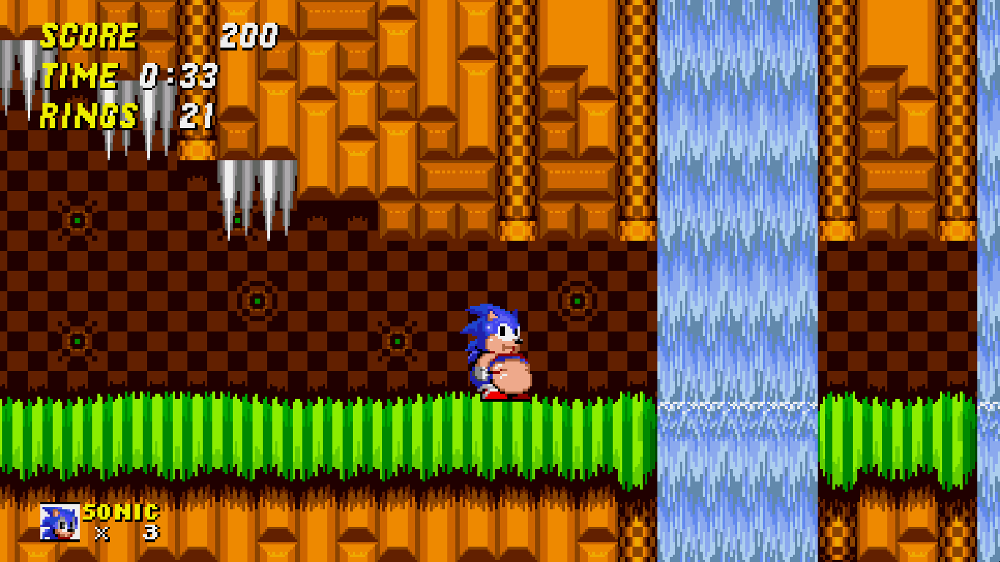

# WidePixels2D
Lightweight C++/SDL2 native runtime for Genesis Plus GX Wide.
> [!NOTE]
> Your ROM must be converted with [Sonic Wide Autopatcher](https://heyjoeway.github.io/sonic-wide-autopatcher/) or download Pre-Patched ones. If you don't do this, you may encounter problems with the game.

